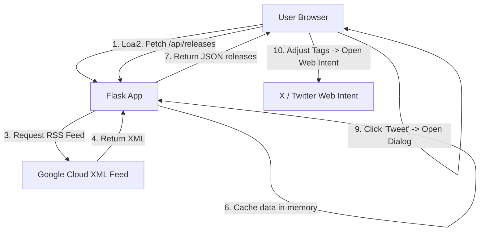
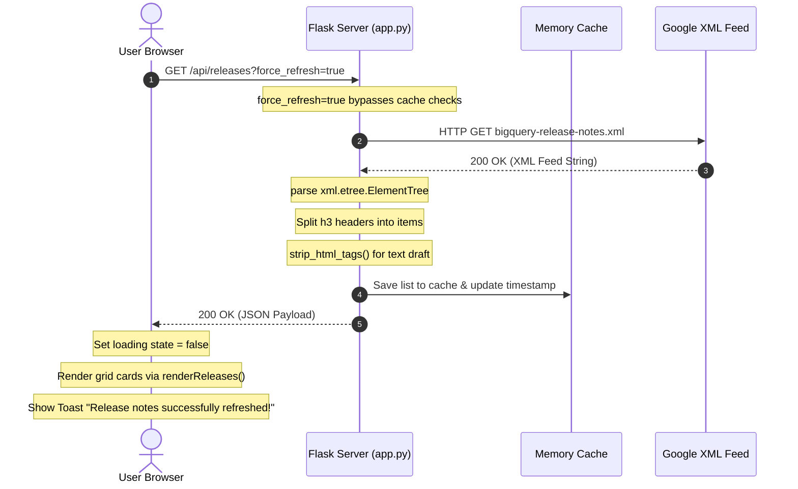

# BigQuery Release Insights Hub

A beautiful, premium web dashboard that fetches the latest official BigQuery Release Notes, parses them into searchable and filterable updates, and allows you to customize and share any update directly to X (formerly Twitter) with a single click.

---

## 🌟 Features

- **Live RSS Sync**: Fetches release notes directly from the official Google Cloud feed: `https://docs.cloud.google.com/feeds/bigquery-release-notes.xml`
- **Granular Update Breakdown**: Automatically parses Atom feed entries and extracts separate sub-updates (e.g. `Feature`, `Announcement`, `Breaking`, `Issue`, `Change`) so you can inspect and Tweet about them individually.
- **Performance Caching**: Caches feed contents in-memory for 15 minutes to keep page load times fast, with a manual refresh override option.
- **Premium Glassmorphic Design**: A gorgeous, dark-themed responsive UI with glowing radial gradients, micro-hover animations, skeleton loading cards, and custom scrollbars.
- **Search & Type Filtering**: Real-time keyword search and type category buttons to quickly locate updates on topics like "Gemini" or "embeddings".
- **Native Dialog Tweet Composer**: A premium, custom-styled `<dialog>` modal popup where you can edit the tweet draft, toggle quick hashtags, track character counts with a dynamic SVG progress ring, and post straight to X.
- **Light-Dismiss Fallback**: Seamless overlay closing by clicking outside the modal box, featuring a robust JavaScript compatibility fallback.

---

## 🛠️ Architecture & Data Flow

The application divides responsibilities cleanly between the Python Flask backend and a highly responsive vanilla HTML/CSS/JS frontend.



### Server-Side Details ([app.py](file:///Users/m.haadrehman/bigquery_release_notes/app.py))
- **In-Memory Caching**: Caches parsed results for 15 minutes to avoid rate-limiting and latency, bypassable by setting `force_refresh=true`.
- **Feed Parser**: Utilizes standard Python libraries `xml.etree.ElementTree` and regex matching (`re.findall`) to parse and split multiple clustered updates within an entry block.
- **Plain Text Formatter**: Converts HTML payload tags into standard, clean plain text ready to fit within character limits.

### Client-Side Details
- **Structure ([index.html](file:///Users/m.haadrehman/bigquery_release_notes/templates/index.html))**: Semantic document structure with loader skeletons and a native modal `<dialog>` component.
- **Styling ([style.css](file:///Users/m.haadrehman/bigquery_release_notes/static/css/style.css))**: Glassmorphism colors, custom styling, card lift transition animations, and responsive flex grids.
- **Logic ([app.js](file:///Users/m.haadrehman/bigquery_release_notes/static/js/app.js))**: Keyword filtering, dynamic SVG progress ring offset calculation for character count tracking, and X Web Intent invocation.

---

## 🔄 Sample Request-Response Flow

Below is a sequence walkthrough of what occurs when a user initiates a manual **Refresh** action:



---

## 🚀 Setup & Running Locally

1. **Navigate to the project directory** (if not already there):
   ```bash
   cd bigquery_release_notes
   ```

2. **Activate the Virtual Environment**:
   - On macOS/Linux:
     ```bash
     source venv/bin/activate
     ```
   - On Windows:
     ```bash
     .\venv\Scripts\activate
     ```

3. **Run the Flask development server**:
   ```bash
   python app.py
   ```

4. **Open in your browser**:
   Navigate to [http://localhost:5001](http://localhost:5001) to view the application!

---

## 📂 File Structure

- [app.py](file:///Users/m.haadrehman/bigquery_release_notes/app.py) - Flask server, XML parser, and in-memory cache
- [templates/index.html](file:///Users/m.haadrehman/bigquery_release_notes/templates/index.html) - Main dashboard layout and Tweet composer dialog
- [static/css/style.css](file:///Users/m.haadrehman/bigquery_release_notes/static/css/style.css) - Custom dark glassmorphic styling, animations, progress circle, and badges
- [static/js/app.js](file:///Users/m.haadrehman/bigquery_release_notes/static/js/app.js) - Client logic for API calls, card rendering, filtering, and modal interaction
- [requirements.txt](file:///Users/m.haadrehman/bigquery_release_notes/requirements.txt) - Python package dependencies
